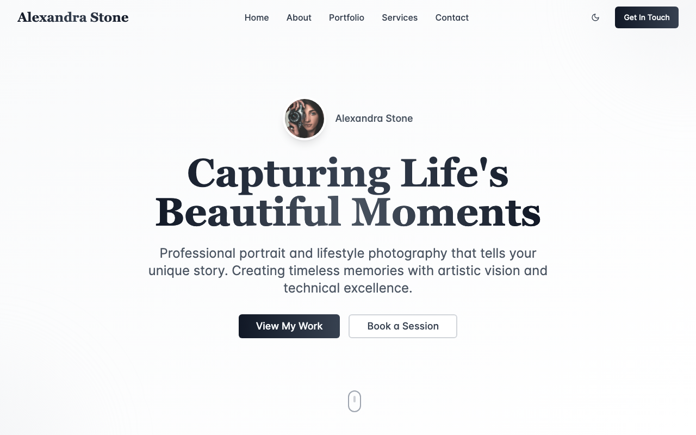
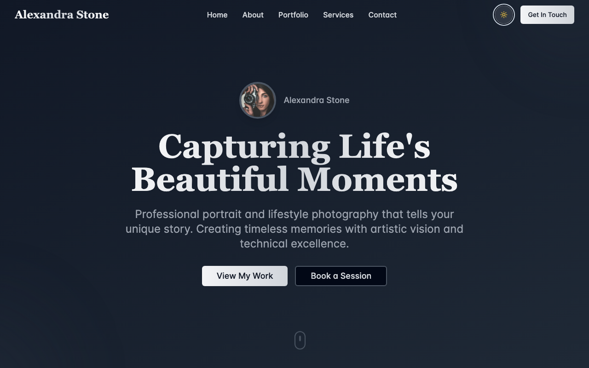

# Alexandra Stone - Professional Photography Portfolio

A modern, animated, and responsive photography portfolio website showcasing professional photography services. Built with React, TypeScript, Tailwind CSS, and shadcn/ui components.






## 🌟 Features

### Design & User Experience
- **Modern & Elegant Design**: Clean, professional aesthetic perfect for photography portfolios
- **Smooth Animations**: Custom CSS animations and transitions throughout the site
- **Responsive Layout**: Fully responsive design that works on all devices
- **Interactive Elements**: Hover effects, smooth scrolling, and micro-interactions
- **Glass Morphism Effects**: Modern UI design with backdrop blur effects

### Sections & Components
1. **Hero Section**: Eye-catching introduction with animated elements
2. **About Section**: Professional biography with statistics and personal photo
3. **Portfolio Gallery**: Filterable image gallery with category sorting
4. **Services Section**: Detailed photography service offerings with pricing
5. **Contact Form**: Functional contact form with validation and toast notifications
6. **Header Navigation**: Smooth scrolling navigation with scroll-based styling
7. **Footer**: Complete site information and social links

### Technical Features
- **TypeScript**: Full type safety throughout the application
- **Tailwind CSS**: Utility-first CSS framework for rapid styling
- **shadcn/ui**: High-quality React components for consistent UI
- **Smooth Scrolling**: JavaScript-powered smooth scrolling navigation
- **Form Handling**: Contact form with state management and validation
- **Toast Notifications**: User feedback system for form submissions
- **Optimized Images**: Placeholder images from Unsplash for demonstration

## 🚀 Getting Started

### Prerequisites
- Node.js (v18 or higher)
- npm or yarn package manager

### Installation

1. **Clone the repository**
   ```bash
   Download project
   ```

2. **Install dependencies**
   ```bash
   npm install
   ```

3. **Start the development server**
   ```bash
   npm run dev
   ```

4. **Open your browser**
   Navigate to `http://localhost:8080` to view the portfolio

## 📁 Project Structure

```
src/
├── components/          # React components
│   ├── ui/             # shadcn/ui components (read-only)
│   ├── Header.tsx      # Navigation header
│   ├── Hero.tsx        # Hero section
│   ├── About.tsx       # About section
│   ├── Portfolio.tsx   # Portfolio gallery
│   ├── Services.tsx    # Services section
│   ├── Contact.tsx     # Contact form
│   └── Footer.tsx      # Site footer
├── pages/
│   ├── Index.tsx       # Main portfolio page
│   └── NotFound.tsx    # 404 error page
├── hooks/              # React hooks
├── lib/                # Utility functions
├── index.css           # Global styles and custom CSS
└── main.tsx           # Application entry point
```

## 🎨 Customization Guide

### Colors & Branding
The color scheme uses a sophisticated grayscale palette. To customize:

1. **Update CSS Variables** in `src/index.css`:
   ```css
   :root {
     --primary: your-primary-color;
     --secondary: your-secondary-color;
   }
   ```

2. **Modify Gradient Classes** in Tailwind config or components:
   ```css
   bg-gradient-to-r from-your-color to-your-color
   ```

### Content Customization

#### Personal Information
Update the following in respective components:

- **Name**: Change "Alexandra Stone" in `Header.tsx` and throughout components
- **Bio**: Update the about text in `About.tsx`
- **Contact Info**: Modify contact details in `Contact.tsx`
- **Statistics**: Update numbers in `About.tsx` (clients, experience, awards)

#### Portfolio Images
Replace placeholder images in `Portfolio.tsx`:
```typescript
const portfolioImages = [
  {
    id: 1,
    src: "path-to-your-image.jpg",
    category: "Your Category",
    title: "Your Image Title"
  },
  // Add more images...
];
```

#### Services & Pricing
Customize services in `Services.tsx`:
```typescript
const services = [
  {
    title: "Your Service",
    description: "Service description",
    price: "Your pricing",
    features: ["Feature 1", "Feature 2"]
  },
  // Add more services...
];
```

### Typography
The site uses two font families:
- **Inter**: For body text and UI elements
- **Playfair Display**: For headings and display text

To change fonts, update the Google Fonts import in `index.css` and the font families in the CSS.

### Animations
Custom animations are defined in `tailwind.config.ts`. Current animations include:
- `fade-in`: Smooth fade in with upward motion
- `fade-in-up`: Enhanced fade in with more pronounced upward motion
- `slide-in-left`: Slide in from the left
- `scale-in`: Scale and fade in
- `float`: Floating animation for decorative elements

## 📱 Responsive Design

The portfolio is fully responsive with breakpoints:
- **Mobile**: 320px - 767px
- **Tablet**: 768px - 1023px
- **Desktop**: 1024px and above

Key responsive features:
- Flexible grid layouts
- Adaptive typography scaling
- Touch-friendly navigation
- Optimized image sizes
- Mobile-first approach

## 🔧 Development

### Available Scripts
- `npm run dev`: Start development server
- `npm run build`: Build for production
- `npm run preview`: Preview production build
- `npm run lint`: Run ESLint

### Adding New Sections
1. Create a new component in `src/components/`
2. Import and add to `src/pages/Index.tsx`
3. Add navigation link in `Header.tsx`
4. Style with Tailwind CSS classes

### Form Integration
The contact form currently uses console logging and toast notifications. To integrate with a backend:

1. Replace the `handleSubmit` function in `Contact.tsx`
2. Add your API endpoint
3. Handle loading states and error cases
4. Update success/error messages

## 🚀 Deployment

### Using Lovable
1. Click the "Publish" button in the Lovable interface
2. Your site will be deployed automatically

### Manual Deployment
1. Build the project: `npm run build`
2. Deploy the `dist` folder to your hosting service
3. Configure your domain (if using custom domain)

Popular hosting options:
- Vercel
- Netlify
- GitHub Pages
- AWS S3 + CloudFront

## 🎯 SEO Optimization

The portfolio includes basic SEO optimizations:
- Semantic HTML structure
- Meta tags in `index.html`
- Alt texts for images
- Proper heading hierarchy
- Clean URL structure

For enhanced SEO:
1. Add structured data markup
2. Implement Open Graph tags
3. Add meta descriptions for each section
4. Optimize image loading with lazy loading
5. Add a sitemap

## 🔒 Performance

Performance optimizations included:
- Optimized Tailwind CSS bundle
- Efficient React component structure
- Smooth animations using CSS transforms
- Placeholder images with proper sizing
- Minimal JavaScript bundle

## 📞 Support & Customization

This portfolio template is designed to be easily customizable for any photographer. Key areas for personalization:

1. **Branding**: Colors, fonts, and visual identity
2. **Content**: Text, images, and service offerings
3. **Functionality**: Contact forms, gallery features
4. **Styling**: Layout adjustments and animation preferences

## 🙏 Credits

Designed and developed by Avodstudio

- **Design Framework**: Tailwind CSS
- **UI Components**: shadcn/ui
- **Icons**: Lucide React
- **Fonts**: Google Fonts (Inter, Playfair Display)
- **Images**: Unsplash (placeholder images)
- **Build Tool**: Vite
- **Framework**: React with TypeScript

## License
This project is licensed under the GPL License - see the LICENSE file for details.


## 📧 Contact
For any inquiries, please reach out through the contact form on our website.

Made with ❤️ by Avodstudio | design by Alex Gogan | developed by Mohamed||Frank

---

**Note**: This is a template portfolio. Replace all placeholder content, images, and contact information with your actual details before deploying to production.
